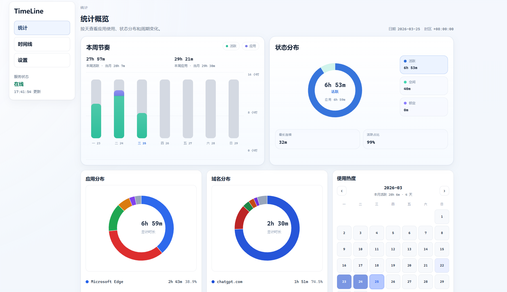
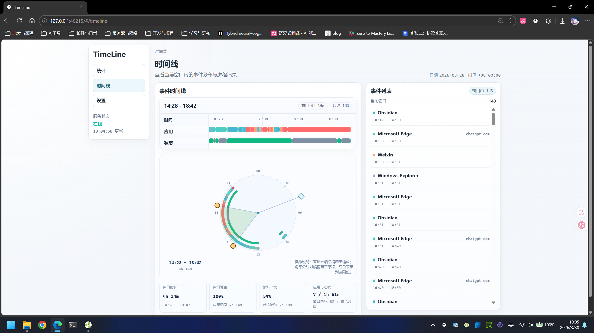
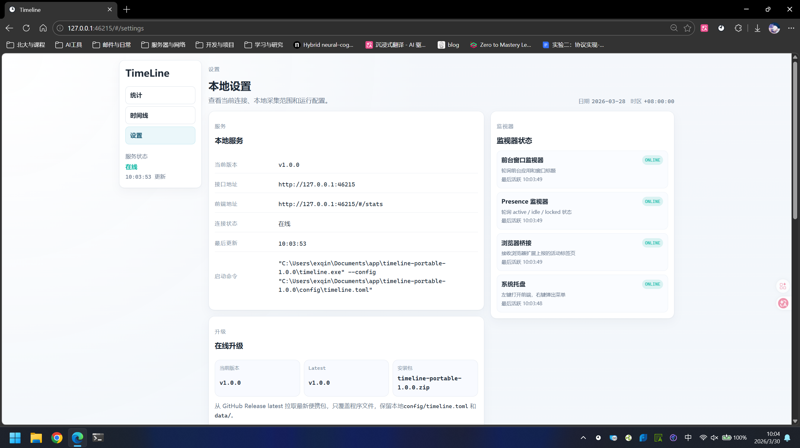

# timeline





一个面向 Windows 的本地个人活动时间线工具。

它的目标很简单：在本机采集前台应用、浏览器域名和活跃状态，写入本地 SQLite，再通过本地 Web UI 把一天的时间都去了哪里展示出来。

## 组件结构

- `apps/timeline-agent`
  Rust 本地常驻服务。负责 Windows 采集、SQLite 存储、本地 HTTP API、托盘、自启动设置。
- `apps/web-ui`
  React + Vite 本地前端。负责时间线、统计图和设置页。
- `apps/browser-extension`
  Edge / Chrome 通用的 Manifest V3 扩展。负责把当前活动标签页域名上报给本地服务。
- `crates/common`
  agent、前端、扩展共享的数据结构。
- `docs/`
  架构、接口和数据模型说明。
  - [架构设计](docs/architecture.md)
  - [接口说明](docs/api.md)
  - [数据模型](docs/schema.md)
  - [前端交互与骨架规范](docs/frontend-guidelines.md)

## 当前能力

- 采集前台应用、进程名、窗口标题
- 采集 `active / idle / locked` 状态
- 接收浏览器扩展上报的域名活动
- 写入本地 SQLite
- 提供每日时间线、应用统计、域名统计、专注统计 API
- 提供本地 Web UI
- 提供系统托盘入口
- 支持开机自启动开关
- 支持从 GitHub Release latest 在线升级便携版

## 隐私边界

- 默认只记录应用名、进程信息、窗口标题、域名和活跃状态
- 默认不记录页面正文、输入内容、剪贴板和截图
- 数据默认只保存在本地 SQLite
- 本地 HTTP API 默认只允许 loopback 来源的浏览器访问

## 开发运行

### 1. 启动 agent

```powershell
cargo run -p timeline-agent
```

如果要显式指定配置文件：

```powershell
cargo run -p timeline-agent -- --config config/timeline-agent.toml
```

默认监听地址是 `127.0.0.1:46215`。

注意：

- 如果配置文件放在 `config\` 目录下，配置里的相对路径应按“相对于配置文件目录”来写
- 示例配置里数据库路径使用 `../data/...`，就是为了匹配这个规则

### 2. 启动前端

```powershell
cd apps/web-ui
npm install
npm run dev
```

开发模式下，前端默认读取 `http://127.0.0.1:46215`。

可选环境变量：

- `VITE_API_BASE_URL`
  显式指定本地 agent API 地址

### 3. 加载浏览器扩展

扩展目录在 `apps/browser-extension`。

加载方式：

1. 打开 `edge://extensions` 或 `chrome://extensions`
2. 开启开发者模式
3. 选择“加载已解压的扩展程序”
4. 指向 `apps/browser-extension`

补充说明：

- 扩展会记住最近一次成功连接的本地 agent 地址
- 如果你把 agent 改到了非默认 loopback 端口，先打开一次自托管仪表盘，扩展会自动学习当前地址

## 配置

示例配置在 [config/timeline-agent.example.toml](config/timeline-agent.example.toml)。

当前主要配置项：

- `database_path`
  SQLite 文件路径
- `lockfile_path`
  单实例锁文件路径
- `listen_addr`
  本地 HTTP 服务监听地址
- `web_ui_url`
  托盘和设置页里展示的 Web UI 地址
- `idle_threshold_secs`
  多久无输入后判定为 idle
- `tray_enabled`
  是否启用系统托盘
- `record_window_titles`
  是否记录窗口标题
- `record_page_titles`
  是否记录页面标题
- `ignored_apps`
  忽略的应用进程名列表
- `ignored_domains`
  忽略的域名列表

## 打包便携版

仓库当前只保留便携包产物，不再生成安装器。

### 前置条件

1. 安装 Node.js / npm
2. 安装 Rust toolchain

### 构建命令

```powershell
.\scripts\build-portable.ps1
```

脚本会自动完成：

1. 构建 `apps/web-ui/dist`
2. 构建 `timeline-agent.exe`
3. 收集浏览器扩展目录
4. 生成便携版 zip 包

输出位置：

- `target\portable\output\timeline-portable-<version>.zip`

### 便携包布局

- `timeline-agent.exe`
- `config\timeline-agent.toml`
- `data\`
- `web-ui\dist\`
- `browser-extension\`

便携包不再额外生成启动脚本，直接运行 `timeline-agent.exe` 即可。

### 在线升级

设置页现在提供“检查更新”和“升级并重启”入口。

升级流程会：

1. 请求 GitHub Release `latest`
2. 下载最新的 `timeline-portable-*.zip`
3. 在 agent 退出后覆盖程序文件
4. 自动重新启动 `timeline-agent.exe`

升级时会保留本地：

- `config\timeline-agent.toml`
- `data\`

也就是说，在线升级不会覆盖你的现有数据库和本地配置。

## GitHub Actions

仓库自带 Windows 打包工作流：

- 支持手动触发
- 在 GitHub Release 发布时自动触发
- Release 场景会把便携版 `.zip` 挂到 Release assets

## 常见说明

### `StartMenuExperienceHost.exe` 是什么

这是 Windows 的开始菜单宿主进程，属于系统组件。

### 为什么会出现跨关机的 active 段

旧数据里如果出现“关机期间仍然是 active”的长段，通常不是实时识别把关机误判成 active，而是历史上某次未正常收尾的 open segment 在下次启动时被错误补尾造成的。

当前代码已经改成按“最后一次真实观测时间”收尾，新生成的数据不会再把关机空档桥接进去。

## 目录参考

```text
timeline/
├─ apps/
│  ├─ browser-extension/
│  ├─ timeline-agent/
│  └─ web-ui/
├─ config/
├─ crates/
├─ docs/
└─ scripts/
```
